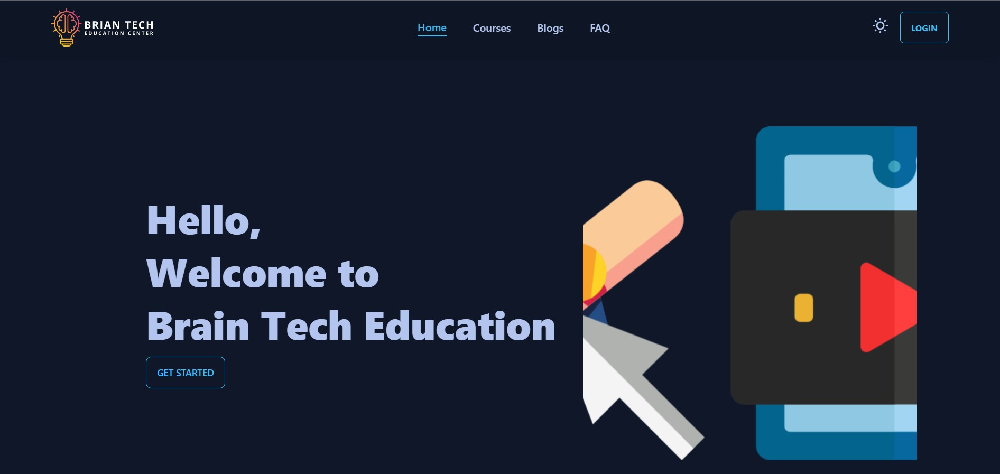
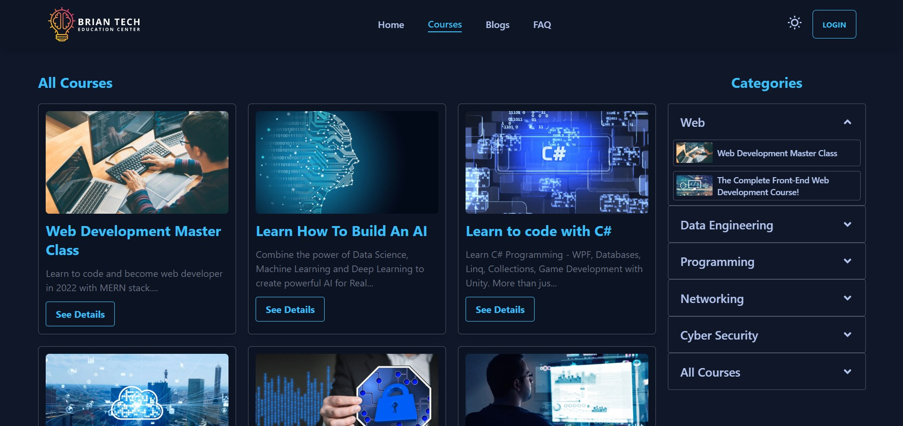
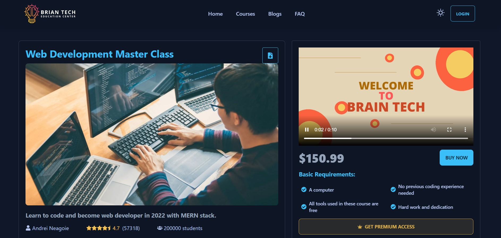
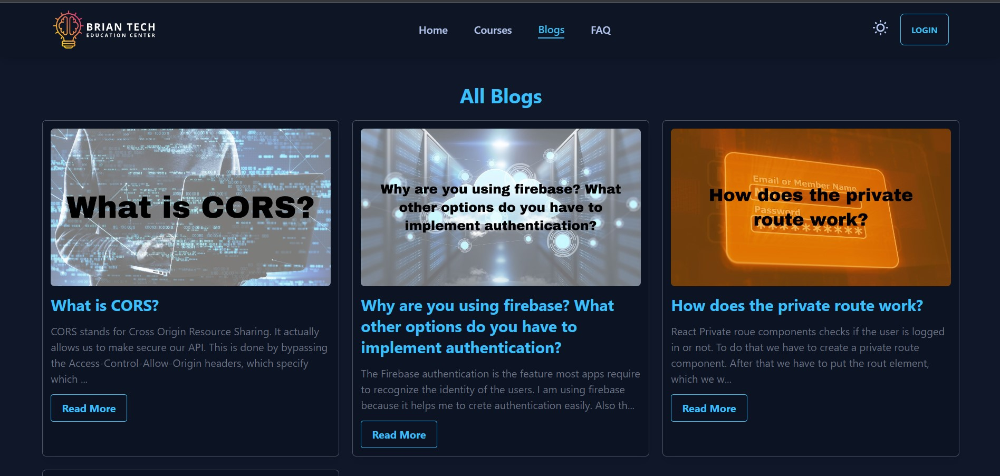
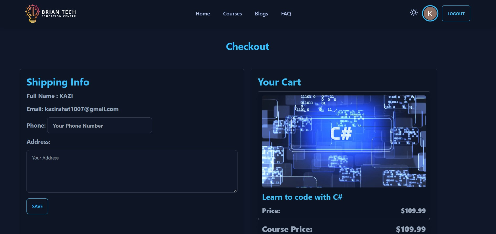
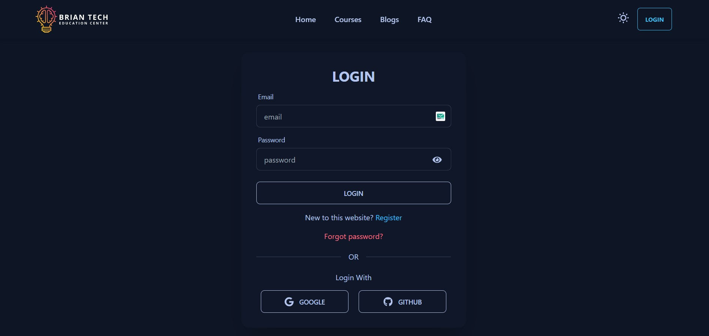
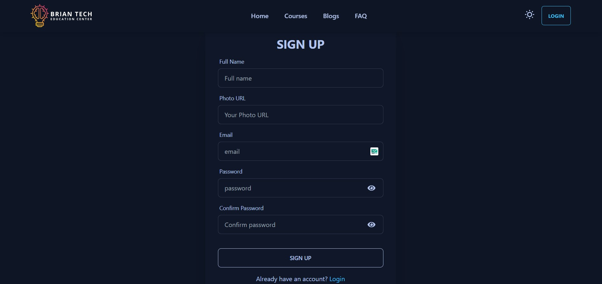

# <a href='https://brain-tech-learn.web.app/'>Brain Tech Education Center</a>

### Live site Link: <a href='https://brain-tech-learn.web.app/'>https://brain-tech-learn.web.app/</a>

#### Brain tech is a online learning platform website. The technologies, which are used to build this website:

-  `React Js`
-  `React Router`
-  `HTML 5`
-  `Context API`
-  `Firebase Authentication`
-  `Tailwind CSS`
-  `Node Js`
-  `Express Js`

## Top Features:

-  `User can select your favorite course and buy it (not real)`
-  `User can read blogs from our blog page`
-  `User can create a account in our website`
-  `User can login into our website`
-  `User can login using their gmail or github account`

## Lets take a look at the main pages of our website:

### 1. Course Page:

### 2. Course Details Page:

### 3. Blogs Page:

### 4. Checkout page: `This is a private route`

### 5. Login Page:

### 6. Register page:

